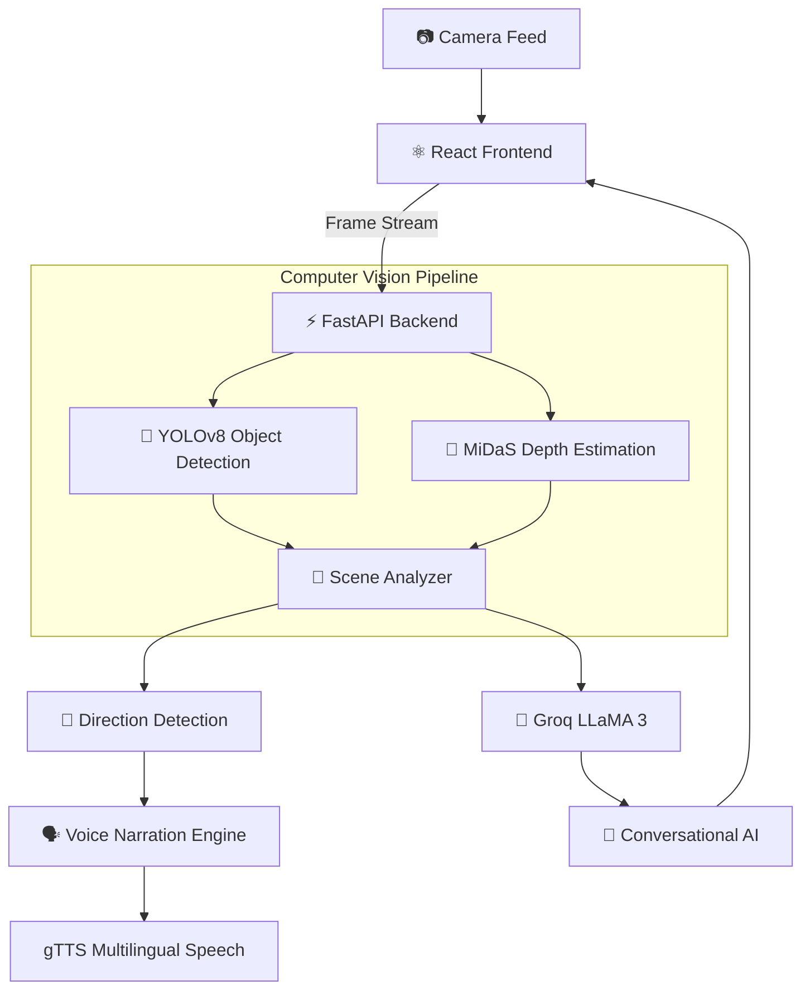

# 👁️ Drishti AI

### An AI-powered multimodal navigation companion that helps visually impaired users understand, navigate, and interact with the world through real-time computer vision, depth perception, and conversational AI.

**Drishti AI** is a production-ready assistive navigation platform designed to improve independent mobility for visually impaired individuals.

Instead of simply detecting objects, Drishti AI combines **real-time object detection**, **monocular depth estimation**, **direction-aware obstacle guidance**, **multilingual voice narration**, and **LLM-powered scene understanding** into one unified accessibility system.

The entire experience runs directly inside a web browser—requiring **no mobile application installation**—making it accessible from laptops, Android phones, and iPhones.

---

# 🎯 Why Drishti AI?

Traditional assistive navigation devices are often:

* Expensive proprietary hardware
* Limited to obstacle detection only
* Internet dependent
* Unable to answer contextual questions
* Difficult to deploy across different devices

Drishti AI approaches accessibility differently.

Rather than acting as a simple object detector, it continuously builds an understanding of the user's surroundings, estimates how close obstacles are, determines their position relative to the user, narrates the environment in the user's preferred language, and answers follow-up questions naturally using conversational AI.

The goal is to transform a camera into an intelligent navigation companion.

---

# 🏗️ System Architecture



---

# 🎯 Real-World Use Case: Walking Through a Busy Street

Imagine a visually impaired user navigating an unfamiliar road.

### 1. Live Camera Feed

The browser continuously streams frames from the user's phone or laptop camera to the FastAPI backend.

---

### 2. Scene Understanding

YOLOv8 detects nearby objects such as:

* Cars
* Motorcycles
* People
* Bicycles
* Dogs
* Traffic signs
* Everyday obstacles

Simultaneously, MiDaS estimates each object's relative depth.

---

### 3. Spatial Awareness

Each detected object is mapped into one of three navigation regions:

* ⬅️ Left
* ⬆️ Center
* ➡️ Right

The closest obstacle receives the highest priority.

Example:

> "Person ahead, two meters, center."

---

### 4. Voice Guidance

The narration engine converts the scene summary into natural speech.

Example:

> "Bicycle approaching from the left."

or

> "Vehicle ahead. Please move slightly right."

The narration is available in:

* English
* Hindi
* Telugu
* Tamil
* Kannada
* Malayalam

---

### 5. Conversational Assistance

The user can immediately ask:

> "Is there a pedestrian crossing?"

or

> "Can I move forward safely?"

Groq LLaMA 3 receives the current scene description and generates contextual responses without requiring the user to interpret raw detection outputs.

---

# ✨ Features

* 🎯 **Real-Time Object Detection:** Uses YOLOv8 to identify pedestrians, vehicles, animals, and everyday obstacles directly from the live camera feed.

* 📏 **Depth Estimation:** Integrates MiDaS DPT-Small to estimate relative object distance from a single RGB image without additional sensors.

* 📍 **Directional Navigation:** Determines whether detected obstacles lie on the left, center, or right side of the user's path for intuitive navigation.

* 🗣️ **Multilingual Voice Guidance:** Converts navigation instructions into natural speech across six Indian languages.

* 🤖 **Conversational Scene Intelligence:** Users can ask questions about their surroundings through voice or text using Groq-powered LLaMA 3.

* 🌐 **Browser-Based Accessibility:** Runs entirely in the browser with no dedicated mobile application required.

* ☁️ **Cloud Deployment:** Frontend hosted on Vercel while inference APIs run on Hugging Face Spaces.

---

# 💡 Why This Architecture Matters

Drishti AI combines multiple AI models into a single perception pipeline rather than treating each capability independently.

### 1. Parallel Vision Processing

Object detection and depth estimation execute simultaneously.

Instead of waiting for one model to complete before running the next, both models analyze the incoming frame in parallel. Their outputs are merged into a unified scene representation, reducing overall inference latency while improving environmental awareness.

---

### 2. Scene Fusion

YOLO identifies **what** exists.

MiDaS estimates **how far away** it is.

The Scene Analyzer combines these independent outputs into semantic navigation instructions such as:

> "Car approaching from the right."

instead of exposing raw bounding boxes or confidence scores.

---

### 3. Priority-Based Narration

Rather than announcing every detected object—which quickly becomes overwhelming—the narration engine ranks objects based on proximity and direction.

Only the most relevant hazards are spoken first, reducing cognitive overload during navigation.

---

### 4. LLM-Augmented Accessibility

Instead of sending images directly to an LLM, Drishti AI first generates a structured scene summary using computer vision.

This lightweight representation is then passed to Groq LLaMA 3 for conversational reasoning, significantly reducing token usage, improving response speed, and avoiding redundant visual processing.

---

# 🛠️ Technology Stack

| Component           | Technology          |
| ------------------- | ------------------- |
| Frontend            | React               |
| Backend             | FastAPI             |
| Object Detection    | YOLOv8              |
| Depth Estimation    | MiDaS DPT-Small     |
| Conversational AI   | Groq LLaMA 3        |
| Speech Recognition  | Whisper             |
| Text-to-Speech      | gTTS                |
| Backend Deployment  | Hugging Face Spaces |
| Frontend Deployment | Vercel              |

---

# 📂 Project Structure

```text
Drishti-AI/

├── backend/
│
├── app.py                 # FastAPI entry point
├── detect.py              # YOLOv8 inference
├── depth.py               # MiDaS depth estimation
├── narrate.py             # Scene summarization
├── voice.py               # Text-to-Speech generation
├── chat.py                # Groq conversational AI
├── Dockerfile
└── requirements.txt

frontend/

├── public/

├── src/

│   ├── App.jsx

│   └── components/

│       ├── Camera.jsx
│       ├── AlertOverlay.jsx
│       ├── VoiceChat.jsx
│       └── LanguageSelector.jsx

package.json
```

| Component              | Responsibility                                                                         |
| ---------------------- | -------------------------------------------------------------------------------------- |
| `detect.py`            | Runs YOLOv8 inference and returns detected objects with confidence scores.             |
| `depth.py`             | Estimates relative object depth using MiDaS DPT-Small.                                 |
| `narrate.py`           | Merges object detection and depth results into human-readable navigation instructions. |
| `voice.py`             | Generates multilingual speech using gTTS.                                              |
| `chat.py`              | Interfaces with Groq LLaMA 3 for contextual scene conversations.                       |
| `Camera.jsx`           | Captures browser camera frames and streams them to the backend.                        |
| `AlertOverlay.jsx`     | Displays detected objects, distances, and navigation cues over the live feed.          |
| `VoiceChat.jsx`        | Enables conversational interaction via voice or text.                                  |
| `LanguageSelector.jsx` | Switches narration language dynamically.                                               |

---

# ⚙️ Installation & Setup

## Backend

```bash
cd backend

pip install -r requirements.txt

python app.py
```

---

## Frontend

```bash
cd frontend

npm install

npm start
```

---

# 🌍 Deployment

## Frontend

Deploy directly to **Vercel**.

```bash
git push origin main
```

Automatic deployments are triggered for every commit.

---

## Backend

Deploy the FastAPI backend using **Hugging Face Spaces (Docker)**.

```bash
Create Docker Space

Upload backend

Configure secrets

Deploy
```

---

# 🚀 Future Enhancements

* Fine-tuned object detection for accessibility-specific obstacles
* GPS-assisted outdoor navigation
* Offline edge inference using ONNX/TensorRT
* Wearable smart-glass integration
* Emergency SOS alerts
* Route planning with turn-by-turn navigation
* Personalized obstacle prioritization
* Haptic feedback support

---

# 🎯 Applications

* Assistive navigation for visually impaired individuals
* Smart mobility systems
* Human-centered AI
* Computer vision accessibility tools
* Educational accessibility research
* AI-powered wearable devices

---

# 📜 License

This project is developed for educational, research, and accessibility-focused purposes.